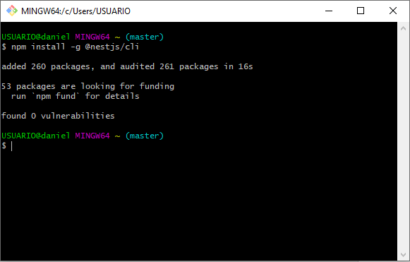
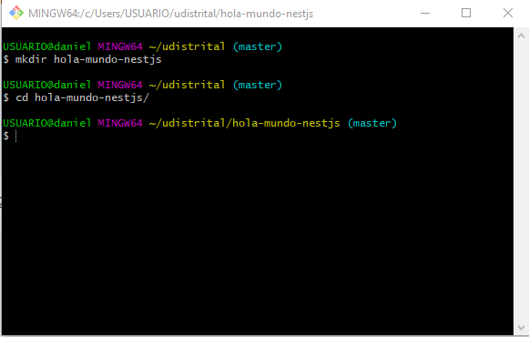
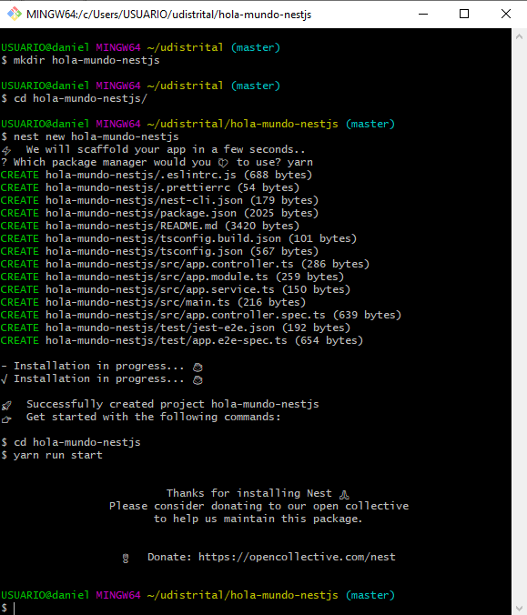
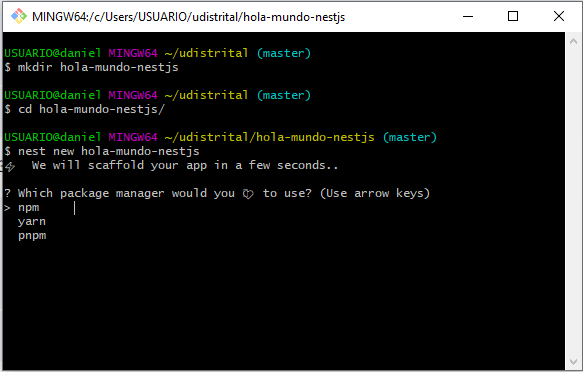
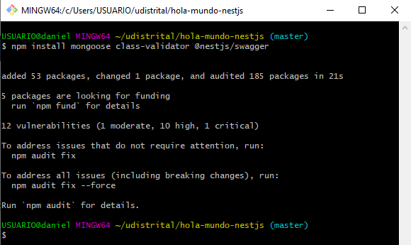
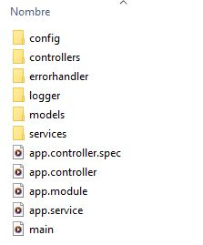

<p align="center">
  
</p>

<h1 align="center"><b>Documentación para la generación y definición de la estructura de proyecto en APIs con base de datos no relacionales (MongoDB) bajo la tecnología NestJs</b></h1>

---

### Introducción

Este documento tiene como objetivo establecer los lineamientos para la generación y definición de la estructura de proyecto en APIs con base de datos no relacionales (MongoDB) bajo la tecnología NestJs. Se detallan las subtareas necesarias para la creación de una API robusta y escalable.

---

### 1. Generación del API (Uso del CLI)

#### Creación del proyecto NestJs:

- Instalar el CLI de NestJs globalmente, Utilizar el comando `npm install -g @nestjs/cli`.



- Crear un nuevo directorio para el proyecto:



- Inicializar el proyecto NestJs:

<div>
    
    
</div>

#### Instalación de dependencias:

- Instalar las dependencias necesarias para trabajar con MongoDB en NestJs, como `npm install mongoose class-validator @nestjs/swagger`.



---

### 2. Configuración de variables de entorno

- Creación de un archivo `.env`

Ejemplo:

```shell
HORARIOS_CRUD_DB=[nombre de la base de datos]
HORARIOS_CRUD_PASS=[password del usuario]
HORARIOS_CRUD_HOST=[direccion de la base de datos]
HORARIOS_CRUD_PORT=[Puerto de conexión con la base de datos]
HORARIOS_CRUD_USER=[usuario con acceso a la base de datos]
HORARIOS_CRUD_AUTH_DB=[base de datos de autorizacion]
HORARIOS_CRUD_HTTP_PORT=[puerto de ejecucion]
```

### 3. Refactorización del proyecto para manejar controlador, modelos y servicios

Organizar el código del proyecto en carpetas separadas para controladores, modelos y servicios.

```shell
+---src
|   |   app.controller.spec.ts
|   |   app.controller.ts
|   |   app.module.ts
|   |   app.service.ts
|   |   main.ts
|   |
|   +---config
|   +---controllers
|   +---errorhandler
|   +---logger
|   +---models
|   \---services
```

Ejemplo:



Dentro del controlador se debe tener en cuenta la estructura de respuesta:
```typescript
type APIResponse struct {
	Success bool        `json:"success"`
	Status  int         `json:"status"`
	Message interface{} `json:"message"`
	Data    interface{} `json:"data"`
}
```

### 4. Manejo de error, filtros (query), logger, healtcheck <a name="manejo-de-error"></a>

#### Logger:
Organizar el código del Logger en carpeta separada llamada `logger`. Este código define un middleware en NestJS para registrar las solicitudes HTTP entrantes y las respuestas salientes. A continuación, se explica cada sección del código:

#### Importaciones

```typescript
import { Injectable, NestMiddleware, Logger } from '@nestjs/common';
import { Request, Response, NextFunction } from 'express';
```
- `@nestjs/common`: Importa los decoradores y las clases básicas de NestJS.
- `express`: Importa las interfaces Request, Response y NextFunction de Express.

#### Decorador @Injectable
`@Injectable()`

- Este decorador marca la clase LoggerMiddleware como un servicio que puede ser inyectado y gestionado por el contenedor de dependencias de NestJS.

#### Clase LoggerMiddleware
```typescript
export class LoggerMiddleware implements NestMiddleware {
    private logger = new Logger('HTTP');
```
- `LoggerMiddleware`: Implementa la interfaz NestMiddleware de NestJS.

- `Logger`: Se usa para registrar los mensajes de log. Se instancia con el contexto 'HTTP'.

#### Método `use`
```typescript
use(request: Request, response: Response, next: NextFunction): void {
    const { method, originalUrl, body } = request;
    this.logger.log(`[REQ] ${method} ${originalUrl} ${JSON.stringify(body)}`);
```
- `use`: Método obligatorio que se ejecuta para cada solicitud HTTP. Toma tres parámetros:

	- `request`: La solicitud HTTP.
  
	- `response`: La respuesta HTTP.
  
	- `next`: La función que se llama para pasar el control al siguiente middleware.

- Extrae el método HTTP (`method`), la URL original (`originalUrl`) y el cuerpo de la solicitud (`body`).

- Registra la solicitud entrante con el método log del Logger.

#### Sobrescritura de response.write y response.end
```typescript
    var oldWrite = response.write;
    var oldEnd = response.end;
    var chunks = [];
    response.write = function (chunk: any) {
        chunks.push(chunk);
        return oldWrite.apply(response, arguments);
    };
    response.end = function (chunk: any) {
        if (chunk) {
            chunks.push(chunk);
        }
        return oldEnd.apply(response, arguments);
    };
```
- Almacena las referencias originales de los métodos `write` y `end` de `response`.
- Sobrescribe estos métodos para capturar los datos que se envían en la respuesta:
	- `response.write`: Añade los fragmentos (`chunks`) de datos a un array.
	- `response.end`: Añade cualquier fragmento adicional y luego llama al método original.

 #### Evento response.on('finish')
 ```typescript
    response.on('finish', () => {
        const { statusCode } = response;
        const responseBody = Buffer.concat(chunks).toString('utf8');
        this.logger.log(
            `[RESP] ${method} ${originalUrl} ${statusCode} ${responseBody}`,
        );
    });

    next();
}
```

- Se registra un evento `finish` en `response` que se dispara cuando la respuesta se completa.

- Dentro del evento:
	- Se obtiene el código de estado (`statusCode`) de la respuesta.
	- Se concatena y convierte a texto UTF-8 el contenido de la respuesta capturado en `chunks`.
	- Se registra la respuesta saliente con el método `log` del `Logger`.

- Finalmente, se llama a `next()` para pasar el control al siguiente middleware o controlador en la cadena de procesamiento.

#### Healtcheck:
El siguiente código se ubica en src/app.service.ts, Este código define un servicio simple en NestJS para realizar una verificación de salud de la aplicación. A continuación, se explica cada sección del código:

#### Importaciones
 ```typescript
import { Injectable } from '@nestjs/common';
```
- `@nestjs/common`: Importa el decorador `Injectable` de NestJS.

#### Decorador @Injectable
```typescript
@Injectable()
```
Este decorador marca la clase AppService como un servicio que puede ser inyectado y gestionado por el contenedor de dependencias de NestJS.

#### Clase AppService
```typescript
export class AppService {
  healthcheck(): Object {
    return {
      Status: "Ok",
      checkCount: check.count++
    };
  }
}
```
- `AppService`: Clase que proporciona métodos de servicio para la aplicación.

- `healthcheck`: Método que realiza una verificación de salud y retorna un objeto con el estado actual y un contador de verificaciones.

#### Método healthcheck
```typescript
healthcheck(): Object {
  return {
    Status: "Ok",
    checkCount: check.count++
  };
}
```

- `healthcheck`: Método que devuelve un objeto con dos propiedades:
	- `Status`: Una cadena de texto que indica que el estado es "Ok".
	- `checkCount`: Un contador que incrementa en uno cada vez que se llama al método.

#### Clase check
```typescript
export class check {
  static count: number = 0;
}
```
`check`: Clase auxiliar que contiene una propiedad estática `count` utilizada para llevar un conteo de las veces que se ha realizado la verificación de salud.

`static count: number = 0`: Inicializa `count` en 0 y permite que se acceda y modifique de manera global en el contexto de la clase `AppService`.

---

### 5. Generación de swagger y detalle de .drone para despliegue <a name="generacion-de-swagger"></a>
---
